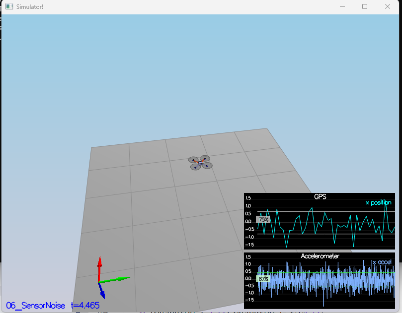
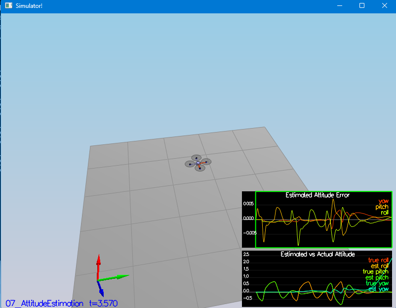

## Project: 3D quadcopter state estimation using an Extended Kalman Filter

### Step 1: Model Sensor Noise

To estimate the standard deviation for the X direction GPS and IMU/Acccelerometer measurements, I exported both of the sensor recording outputs to Excel and calculated the standard deviation using the `STDEV()` function.

The estimates I calculated were:

    Quad.IMU.AX = 0.4952
    Quad.GPS.X = 0.7196

From there, I updated the `MeasuredStdDev_GPSPosXY` and `MeasuredStdDev_AccelXY` and verified that about 68% of the measurements fell within the calculated standard deviations, indicating that the measurement noise follows a Gaussian distribution which makes the Extended Kalman Filter suitable for this use case, along with the non-linearities in the state transition function and measurement function.



## Step 2: Perform Attitude Estimation

To estimate the roll and pitch attitude of the quadcopter based on the IMU measurements, I implemented the Non-Linear Complimentary Filter using quaternions to integrate the body rates coming from the IMU into udpated Euler angles.

In the `UpdateFromIMU()` method, I implemented equation (43) in Estimation for Quadrotors `qt_bar = dq * qt` which acts as a numerical integration method to advance the attitude state of the quadcopter forward in time `dt`.

First, the method gets the estimated attitude in quaternion form

```Quaternion<float> qt = EstimatedAttitude();```

Next, the method performs an integratation on the current attitude state `qt` by multiplying it by the quaternion resembling the the measured body rates from the IMU `dq` over time `dt`. The output of this is the predicted state `qt` after applying those rotations over the time step.

```Quaternion<float> qt_bar = qt.IntegrateBodyRate(lastGyro, dtIMU);```

Then the method transforms the predicted attitude state back into the Euler angle representation in the inertial frame, `predictedEuler`

```V3D predictedEuler = qt_bar.ToEulerRPY();``` 

Lastly, it destructures the `predictedEuler` vector into it's roll, pitch and yaw components and passes the roll and pitch components to the Complimentary Filter (CF) implementation to output the estimated roll and pitch. Yaw is not handled in the CF, but is normalized and passed directly to the `ekfState`.



## Step 3: Implement the Prediction Step

To implement the Prediction step of the EKF, I implemented the three prediction methods: 

`PredictState()`, `GetRbgPrime()`, and `Predict()`

First, within the `PredictState()` method

Implemented the state transition function g()

Implemented the Jacobian of the state transition function g_prime()

Propogated the Covariance and the State forward in the Predict step

## Step 4: Update the Magnetometer

## Step 5: Closed Loop + GPS Update

